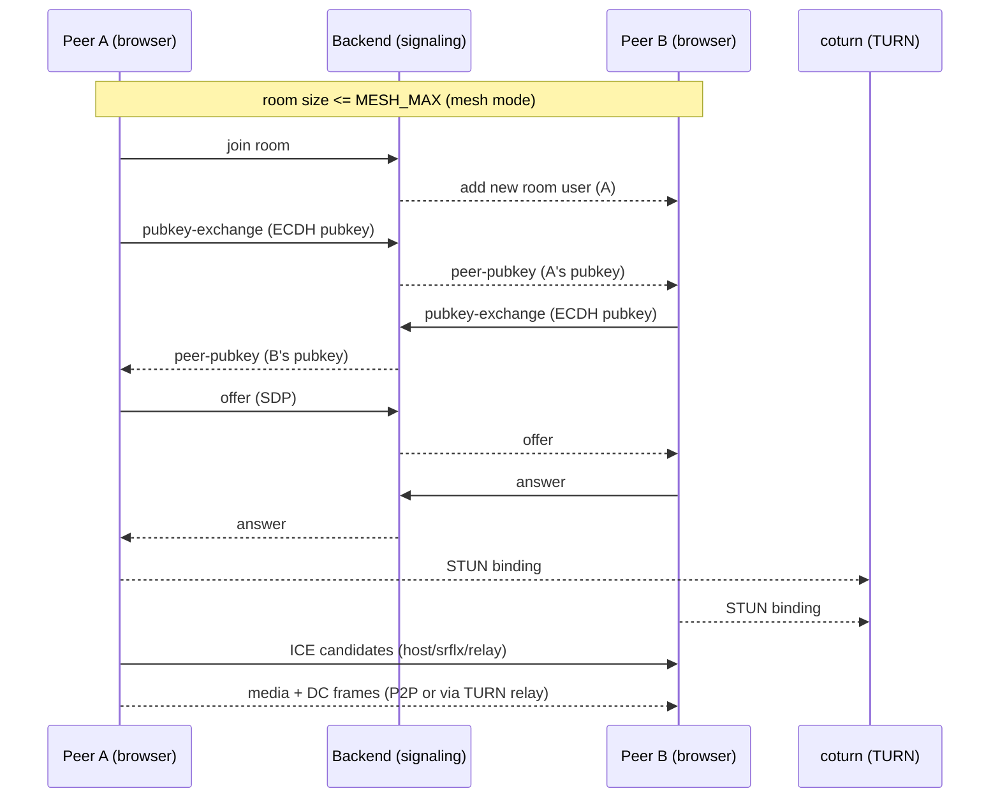
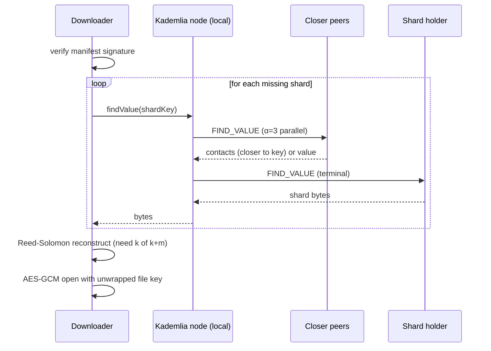
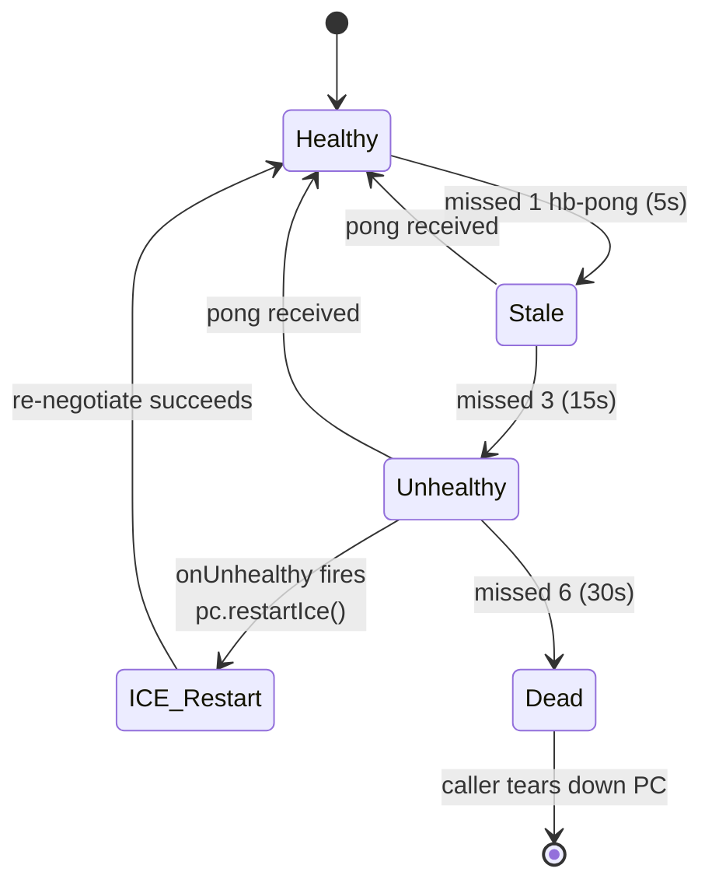

# Socket-WebRTC

A networks-domain showcase: peer-to-peer video, chat, file transfer, an
encrypted distributed drive, and an SFU upgrade path — built on WebRTC,
mediasoup, a hand-rolled ARQ-with-congestion-control protocol, Reed-Solomon
erasure coding, a toy Kademlia DHT, AES-GCM media+chat E2EE, and observable
via Prometheus + Grafana.

The project is deliberately **depth-first over feature-breadth**: each piece
is small, intentionally instrumented, and meant to demonstrate a CS-networks
concept end-to-end rather than ship the most features per square inch.

---

## What's in the box

| Layer            | Component                                  | Notes                                                                   |
|------------------|---------------------------------------------|-------------------------------------------------------------------------|
| Signaling        | socket.io over Express + zod-validated     | Backwards-compat string/object payloads; stable per-room state machine. |
| Auth             | Magic-link JWT (HS256) + session token     | Single-use jti; soft-mode default, `AUTH_REQUIRED=true` to enforce.     |
| ICE              | STUN + coturn (TURN REST API HMAC creds)   | Short-lived bearer creds; STUN-only graceful fallback.                  |
| Mesh             | RTCPeerConnection per pair                 | DC heartbeat (5 s ping/pong) + ICE restart on failure or stalled DC.    |
| SFU              | mediasoup 3.19 router per room             | One-way `mesh → sfu` ratchet at `SFU_MESH_MAX` (default 4).             |
| Simulcast / ABR  | 3-layer (l/m/h) + AIMD on `getStats()`     | tighten on loss > 5% or no headroom; loosen on loss < 2% with headroom. |
| Media E2EE       | AES-GCM per RTP frame via `RTCRtpSender.transform` | Group key wrapped under per-pair ECDH; SFU forwards opaque bytes. |
| Chat E2EE        | per-pair ECDH → AES-GCM + safety numbers   | Server only ever sees ciphertext on the relay path.                     |
| File transfer    | DataChannel chunks with SHA-256 verify     | 64 KiB chunks; backpressure via `bufferedAmountLowThreshold`.           |
| ARP (custom)     | Toy ARQ over unreliable+unordered DC       | Demonstrates retransmit + AIMD congestion control we re-implement.      |
| Distributed drive| Reed-Solomon (k=10, m=4) over GF(2^8)      | Files sealed with AES-GCM, ECIES key wrap, ECDSA-signed manifests.      |
| Drive lookup     | Kademlia DHT (k=8, α=3) over chat DC       | Iterative `FIND_VALUE` → O(log N) routed hops vs O(N) flood.            |
| Resilience       | Socket reconnect + DC heartbeat + ICE restart | Aggregate health pill (good/degraded/bad) in the room header.        |
| Observability    | `/metrics` Prometheus + Grafana dashboard  | Aggregate SFU bitrate + per-room mode + auth + socket events.           |
| Tests            | vitest backend + frontend (39 tests)       | Pure-algorithm coverage on heartbeat / ABR / DHT / JWT / zod / mode.    |
| CI               | GH Actions: typecheck + lint + test + build| Docker images built on PR/main to validate Dockerfiles still compose.   |

---

## Quick start (Docker)

```bash
# 1. Generate secrets and fill in the environment.
cp .env.example .env
openssl rand -hex 32   # paste into AUTH_JWT_SECRET
openssl rand -hex 32   # paste into TURN_SECRET

# 2. Bring up everything (backend + frontend + coturn + prometheus + grafana).
docker compose up -d --build

# 3. Open the app
#   App           http://localhost:8080
#   Backend API   http://localhost:3000
#   Prometheus    http://localhost:9090
#   Grafana       http://localhost:3001  (admin/admin by default)
```

## Quick start (npm, no Docker)

```bash
# Backend (port 3000)
cd backend && npm ci && cp .env.example .env && npm start

# Frontend (port 8080)
cd frontend && npm ci && npm run dev

# Optional coturn for real NAT traversal
docker compose up -d coturn
```

---

## Architecture

### Signaling + media flow



### Mesh → SFU upgrade at threshold

```mermaid
sequenceDiagram
  participant Peer
  participant Server
  participant Router as mediasoup Router
  Note over Server: room size crosses SFU_MESH_MAX
  Server-->>Peer: room-mode { mode: 'sfu' }
  Peer->>Server: sfu:get-rtp-capabilities
  Peer->>Server: sfu:create-transport (send + recv)
  Peer->>Router: DTLS handshake
  Peer->>Server: sfu:produce (video + audio)
  Server-->>Peer: sfu:new-producer (other peers)
  Peer->>Server: sfu:consume per producer
  Note over Peer,Router: With E2EE: RTCRtpSender.transform encrypts<br/>each frame; router forwards opaque bytes.
```

### Distributed drive — upload

```mermaid
flowchart LR
  A[File bytes] --> B[AES-GCM seal<br/>per-file key]
  B --> C[Split into k=10 data shards]
  C --> D[Reed-Solomon encode<br/>m=4 parity over GF(2^8)]
  D --> E[14 shards total]
  E --> F[Round-robin allocate to peers]
  F --> G[For each shard:<br/>offer → ack → store → ack]
  F --> H[Self-store own slot]
  G --> M[Sign manifest<br/>ECDSA P-256]
  H --> M
  M --> N[Broadcast manifest to room]
  M --> O[Publish each shard to DHT<br/>k=8 closest to H&#40;fileId,index&#41;]
```

### Drive download with DHT lookup



### Connection resilience



---

## Repository layout

```
backend/
  src/
    auth/            # magic-link JWT, /auth routes, socket middleware
    sfu/             # mediasoup worker/router/transport/handlers
    rooms/           # mode reconcile + password gating
    signaling/       # join/offer/answer/candidate/relay handlers
    mail/            # nodemailer transporter + /mail/send
    turn/            # /turn-credentials (REST API HMAC)
    observability/   # prom-client metrics + sampler + /metrics
    validate/        # zod schemas for every accepted payload

frontend/
  src/
    components/      # RoomView, NetworkDiagnostics, DriveSheet, ARPVisualizer, ...
    hooks/           # useSfu, useDrive, useMediaE2EE, useConnectionHealth, useWebRTCStats
    lib/
      abr/           # AIMD adaptive bitrate controller
      arp*/          # custom ARQ + congestion control
      authClient.ts  # magic-link redeem + session storage
      chatCrypto.ts  # ECDH per-pair + AES-GCM + safety numbers
      dht/           # toy Kademlia (nodeId, kbucket, kademlia, protocol)
      drive/         # file crypto, manifest, protocol, peerStore, driveClient
      erasure/       # GF(2^8) + Reed-Solomon
      mediaE2EE/     # RTCRtpSender.transform encrypt/decrypt
      resilience/    # heartbeat tracker
      sfuClient.ts   # mediasoup-client wrapper

observability/
  prometheus.yml                     # scrape config (backend:3000)
  grafana-dashboard.json             # rooms/peers/sfu bitrate/auth panels
  grafana-provisioning/              # auto-load dashboard + datasource

coturn/turnserver.conf               # TURN/STUN config
docker-compose.yml                   # backend + frontend + coturn + prometheus + grafana
.github/workflows/ci.yml             # typecheck + lint + test + build
```

---

## Feature reference

### NAT traversal

`coturn` runs as a separate container with the standard TURN REST API: the
backend mints short-lived credentials of the form
`username = <expiry>:<userId>`, `credential = base64(HMAC-SHA1(secret, username))`.
The secret never travels over the wire; coturn validates by recomputing the
HMAC.

When `TURN_SECRET` / `TURN_HOST` aren't configured, the credential endpoint
still responds 200 with STUN-only — the app stays usable, just without NAT
relay fallback. The Network sheet in the room header shows the selected ICE
candidate path (`host ↔ host`, `srflx ↔ srflx`, `relay`, etc.) so you can see
exactly which path is in use.

To force a relayed path for testing, block UDP egress on one tab's profile,
or temporarily set `iceTransportPolicy: "relay"` in `frontend/utils.ts`.

### Custom ARP (ARQ + congestion control)

`frontend/src/lib/arp*` implements a tiny ARQ-with-AIMD-congestion-control
protocol on top of an **explicitly unreliable + unordered** DataChannel
(`{ ordered: false, maxRetransmits: 0 }`), so SCTP doesn't paper over the
loss/reorder we want to demonstrate handling ourselves. Visualised in the
"ARP" sheet.

### End-to-end encryption

- **Chat**: ECDH P-256 keypair generated per session; per-pair AES-GCM key
  derived via HKDF; safety-number panel (SHA-256 over both pubkeys, formatted
  as 6-block hex) lets users verify out-of-band. Server only sees ciphertext.
- **Media**: Group key wrapped under each pair's chat AES-GCM, transmitted
  via DC; per-frame `(keyId || counter)` IV; `RTCRtpSender.transform` /
  `RTCRtpReceiver.transform` apply AES-GCM at the sender / receiver. SFU
  forwards opaque bytes — and you can confirm via DevTools that the wire
  payload is not raw VP8.

  Limitations: Chromium-only transform API today; no key rotation on member
  change in v1; mediasoup-client `transport.handler._pc` access is fragile
  across versions.

### Distributed drive

Reed-Solomon over GF(2^8) with a Cauchy generator matrix, hand-rolled in
`frontend/src/lib/erasure/`. Default `k=10, m=4` means files survive any
4 of 14 shards going missing. Files are sealed with a per-file AES-GCM key
that's wrapped under the owner's ECDH public key (ECIES-style). Manifests
are canonical-JSON ECDSA-signed and broadcast to the room.

Smoke tests: RS round-trip, random shard drops, drop-all-data (parity-only
recovery), split-recombine, file-crypto round trip + tamper detect, and a
6-peer fanout surviving 2-peer loss.

### Kademlia DHT (`lib/dht/`)

Toy implementation that wires into the chat DC under a `drive:dht` envelope.
- 160-bit node ids derived from SHA-256 of the socket id.
- 160-bucket routing table (`k=8` LRU slots).
- PING / FIND_NODE / FIND_VALUE / STORE wire messages.
- Iterative lookup at `α=3` parallelism with per-request timeouts.
- Drive integration: shards published via `node.store(shardKey, data)`;
  downloader tries `node.findValue(shardKey)` before the broadcast fallback.

### Adaptive bitrate (SFU only)

3-layer simulcast (`l 320×180@150k`, `m 640×360@500k`, `h 1280×720@1500k`)
with per-layer floors (80/200/500 kbps) and ceilings (250/800/2500 kbps).
The AIMD loop in `lib/abr/abr.ts` reads `availableOutgoingBitrate` from the
selected candidate-pair and loss from `remote-inbound-rtp` every 2s, then
calls `RTCRtpSender.setParameters()` to adjust per-layer maxBitrate. Surfaced
in NetworkDiagnostics as the "Adaptive bitrate" card with an up/down/hold
arrow.

### Magic-link auth

`POST /auth/request-link` signs a 10-min HS256 JWT, emails the link via the
existing nodemailer transporter (Ethereal preview URL when `SMTP_HOST` is
unset). `POST /auth/redeem` swaps it for a 24-h session JWT, refusing
replays via an in-process jti tracker. The frontend pulls `?magic=<jwt>` off
the URL on first mount, stores the session in localStorage, and threads the
token into `socket.io` handshake auth.

Soft-mode by default; set `AUTH_REQUIRED=true` to reject unauthenticated
sockets.

### Observability

`/metrics` exposes the standard set in Prometheus exposition format. The
sampler runs every 5s (configurable via `METRICS_INTERVAL_MS`) and walks
the SFU sessions to compute aggregate egress/ingress bitrate.

Provisioned Grafana dashboard panels:
- Connected sockets, active rooms, SFU producers/consumers (stat tiles).
- SFU egress vs ingress bitrate (timeseries, bps).
- Per-room peer count + per-room mode (mesh/sfu) bands.
- Socket events/sec by event type.
- Auth flow (magic-link sent / redemption result).

---

## Configuration

See `.env.example` (root) and `backend/.env.example` for the full list. The
ones you'll most often touch:

| Variable                  | Default                     | Description                                                |
|---------------------------|------------------------------|------------------------------------------------------------|
| `AUTH_JWT_SECRET`         | per-process random + warn    | HS256 secret. Generate with `openssl rand -hex 32`.        |
| `MAGIC_LINK_BASE`         | `http://localhost:8080`      | Origin the magic link redirects to.                        |
| `AUTH_REQUIRED`           | `false`                      | Set `true` to reject unauthenticated socket connections.   |
| `SFU_MESH_MAX`            | `4`                          | Room size at which mesh flips to SFU.                      |
| `TURN_SECRET` / `TURN_HOST` | empty (STUN-only fallback) | Generate a 32-byte hex secret and a reachable host.        |
| `TURN_CREDENTIALS_TOKEN`  | empty (open)                 | Optional bearer-token gate on `/turn-credentials`.         |
| `MAIL_TOKEN`              | empty (open)                 | Optional bearer-token gate on `/mail/send`.                |
| `METRICS_INTERVAL_MS`     | `5000`                       | Sampler tick.                                              |

---

## Development

```bash
# Backend
cd backend
npm ci
npm test          # vitest run (22 tests)
npm start         # tsc -b && node dist/server.js

# Frontend
cd frontend
npm ci
npm test          # vitest run (17 tests, jsdom)
npm run dev       # vite at https://localhost:8080 if the mkcert pem is present
npm run build
npm run lint
```

CI runs all of the above on every PR + push to `main`/`atharva` and also
builds both Docker images on PR/main as a Dockerfile sanity check.

### Why some lint warnings remain

The shadcn UI + a few historical `import.meta as any` / `any` annotations
in `Index.tsx` and `RoomView.tsx` predate this push and intentionally aren't
silenced. CI runs lint as `continue-on-error` to surface them in PR diffs
without failing the build. New lint failures introduced by a PR show up
clearly against this baseline.

---

## What's deliberately out of scope (for now)

- Screen sharing, Yjs whiteboard, live captions, recording, PWA install.
  These add UI surface area without exercising the networking spine. They're
  follow-ups once observability has confirmed the spine is solid under load.
- Persistent drive storage (today everything is in-memory; reload wipes it).
- DHT bucket refresh + iterative STORE + candidate-slot eviction policy
  (toy version drops new contacts when buckets are full).
- Firefox / Safari media E2EE (needs `RTCRtpScriptTransform` with a Worker;
  Chromium-only today).
- Multi-instance deployment (the auth jti tracker and SFU session map are
  in-process; would need Redis to scale horizontally).

---

## License

ISC. See `package.json`.
